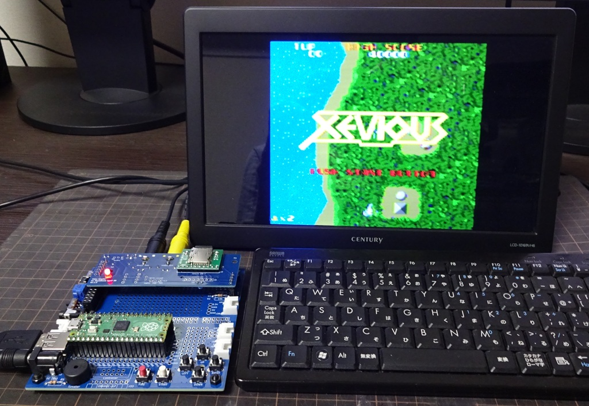

# MachiKania type PU Pico Xeviousもどき  
Katsumi様、KenKen様作成の[MachiKania type M](http://www.ze.em-net.ne.jp/~kenken/machikania/typem.html)用に作成した「Xeviousもどき」を  
[MachiKania type PU](http://www.ze.em-net.ne.jp/~kenken/machikania/typepu.html)へ移植しました。  

　MachiKania type PU  
  

uf2フォルダー内のファイルを参照ください。  
　　pico版、pico2版、xiao版、xiao2版に分けて保存しています。  
 　※UEBKeyBoadにも対応　キー操作はphyllosoma_Pに準拠、FIREキーはZキー、STARTキーはXキーを追加
